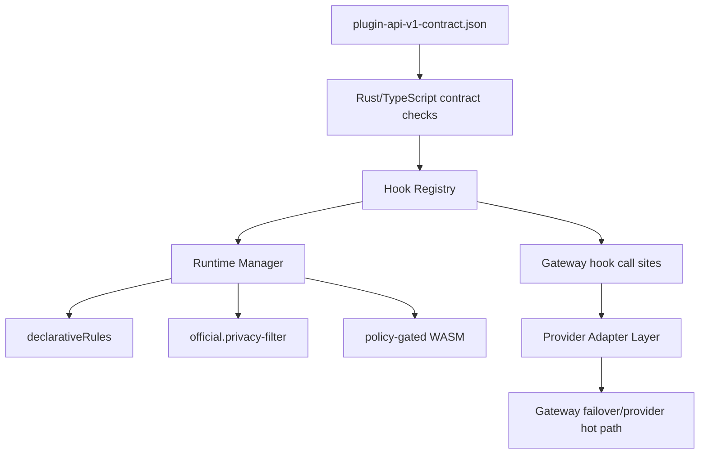

# aio-coding-hub 0.62.0 插件平台内核设计

日期：2026-06-21

## 目标

0.62.0 是插件系统的平台内核重构版本。目标不是开放更多外部插件 API，而是在插件生态仍然早期时，把宿主内部的 contract、hook、runtime、provider adapter 边界整理清楚，降低后续扩展的技术债和维护成本。

本版本必须保持现有功能一致：

- `plugin.json` v1 外部结构不破坏。
- 现有 active hooks 不重命名、不改变触发语义。
- `declarativeRules`、`official.privacy-filter`、`@aio-coding-hub/plugin-sdk`、`create-aio-plugin validate/replay/pack` 保持兼容。
- 不新增公开 provider 插件 API。
- 不开放第三方 JavaScript/TypeScript 或 WebView 插件执行。

## 背景判断

项目是 Tauri 2 GUI 桌面应用，目标平台是 Linux、macOS、Windows 的可执行程序，不是 H5 应用。因此插件执行边界应在 Rust host、gateway、provider adapter、文件安装、IPC 和审计层；React 前端负责管理、配置、授权和可视化，不作为插件执行环境。

当前 Plugin API v1 的外部设计没有明显硬伤。它保持了较小的 active surface：gateway request/response/stream/log hooks、权限裁剪、声明式规则、官方 privacy filter 和 SDK/脚手架。问题主要在内部实现：

- contract 信息分散在 JSON、Rust、TypeScript、文档和脚手架中。
- hook 语义散落在 enum、validation、context trimming、permission enforcement、pipeline 和真实 gateway 调用点中。
- runtime dispatch、缓存、policy 和错误分类还没有形成清晰的平台抽象。
- provider 特例逻辑分散在 middleware、failover prepare、attempt、response 等路径中，未来扩展 provider 能力会继续推高 gateway hot path 复杂度。

因此 0.62.0 采用内部平台化重构，不引入 Plugin API v2。只有后续证明 v1 外部 API 阻塞平台化时，才单独进入 v2 RFC。

## 参考实践

设计参考成熟插件系统的共同模式：

- VS Code 使用 manifest 声明 contribution points、activation events，并通过 extension host 隔离执行。
- Chrome Extensions 使用 manifest permissions、service worker 生命周期和 declarative APIs 控制能力边界。
- Tauri 2 通过 Rust 插件、commands 和权限把桌面能力暴露给 WebView。
- Kong Gateway 使用明确的 gateway phase、priority、schema 和 handler 作为插件扩展点。
- Backstage 和 JetBrains 平台强调 extension points，而不是让插件任意修改宿主内部。

这些实践共同支持本版本的方向：稳定声明式 contract、明确 extension points、权限与运行时隔离、host core 小而可信。

## 总体方案

采用分层平台化方案，按依赖顺序推进：

1. Contract Layer：`plugin-api-v1-contract.json` 成为唯一事实源。
2. Hook Registry Layer：统一 hook 阶段、context、permission、mutation、failure policy 和审计规则。
3. Runtime Layer：统一 runtime dispatch、policy、cache lifecycle、错误分类和性能预算。
4. Provider Adapter Layer：收敛 CX2CC、Gemini OAuth、Codex/Claude 等 provider 特例到内部 adapter/capability 层。

外部 Plugin API v1 保持不变。新增能力只在内部沉淀，不在 0.62.0 暴露给第三方插件作者。



## Contract Layer

### 当前短板

Hook、permission、runtime、mutation 和 config schema 信息散在多处。现有检查脚本能发现部分字符串缺失，但不能完整证明 Rust validation、TypeScript SDK、docs、scaffold、replay 与 canonical contract 的结构一致。

### 设计

继续使用 `docs/plugins/plugin-api-v1-contract.json` 作为 canonical contract，并扩展其结构化表达：

- hook id、类别、active/reserved 状态、阶段说明。
- context fields 与 read permissions 的对应关系。
- mutation fields 与 write permissions 的对应关系。
- 默认 timeout、failure policy、reserved header policy。
- runtime 分类：community、policy-gated、official-only。
- config schema 支持类型。
- plugin API compatibility 与 SemVer 规则。

0.62.0 先以结构化强校验为主，不要求一次性把 Rust/TS 全部改为生成代码。这样可以降低一次性 diff 风险，同时保证新增或修改 contract 时，未同步的 Rust、SDK、docs 或 scaffold 会明确失败。

### 验收

- `pnpm check:plugin-api-contract` 能指出具体 drift 类型：SDK 缺 union、Rust validation 缺 hook、docs 缺描述、scaffold/replay 不支持。
- 历史字段如 `contextPatch` 不能重新进入 active contract。
- 不改变 `PluginManifest` 和 `PluginHookResult` 的对外 shape。
- contract check 覆盖 active hooks、reserved hooks、active permissions、reserved permissions、runtime categories、mutation fields、failure policy、timeout。

## Hook Registry Layer

### 当前短板

Hook 语义分散在多处：hook 名称、active/reserved 判断、context trimming、mutation enforcement、排序、timeout、failure policy、audit 和真实调用点。新增 hook 需要跨多个文件同步，容易造成 manifest 校验、SDK 类型、运行时触发、权限 enforcement 之间的语义漂移。

### 设计

新增内部 `HookRegistry` 和 `HookDescriptor`，由 contract metadata 驱动。每个 descriptor 描述：

- `id`：例如 `gateway.request.afterBodyRead`。
- `kind`：request、response、stream、log。
- `phase`：body-read 后、before-send、response-after、stream-chunk 等。
- `status`：active 或 reserved。
- `defaultFailurePolicy` 和 `timeoutBudget`。
- `allowedReadPermissions`。
- `allowedMutationFields`。
- `requiredWritePermissions`。
- `reservedHeaderPolicy`。
- `auditPolicy`。

模块边界建议：

```text
src-tauri/src/gateway/plugins/
  contract.rs
  registry.rs
  context.rs
  mutation.rs
  pipeline.rs
```

`context.rs` 保留 context model 和 builders；`mutation.rs` 负责 result normalization、header/body/stream/log mutation 应用和权限 enforcement；`pipeline.rs` 只负责排序、timeout、circuit、audit 和 executor 调用。

### 行为保持

- `gateway.request.afterBodyRead` 仍在 body reader 后执行。
- `gateway.request.beforeSend` 仍在单次 provider attempt 发送前执行。
- `gateway.response.chunk` 仍是 chunk 级流式处理，不缓冲完整 stream。
- `gateway.response.after` 仍只处理 non-stream 完整响应。
- `gateway.error` 失败后保留原始 host error response。
- `log.beforePersist` 失败后保留原始 request log payload。
- reserved hooks 继续被 manifest validation 拒绝。

### 验收

- 每个 active hook 有固定 fixture 测试：context trimming、合法 mutation、非法 mutation、failure policy、audit。
- permission trimming 和 mutation enforcement 由同一份 descriptor 驱动。
- 无插件时 request path 和 stream path 继续保持 fast path。
- 新增 hook 的最小步骤变为：添加 contract descriptor、添加调用点、添加 fixture。

## Runtime Layer

### 当前短板

Runtime dispatch 已经能分发 `declarativeRules`、官方 privacy filter 和 policy-gated WASM，但 runtime 选择、缓存、policy、错误分类、性能预算与 pipeline 职责仍有耦合。后续如果开放 WASM 或 process runtime，复杂性容易回流到 gateway pipeline。

### 设计

新增内部 `PluginRuntimeManager`，保持外部 runtime 声明不变。职责包括：

- 选择 runtime：`declarativeRules`、official native、policy-gated WASM。
- 执行 policy：WASM 默认禁用；process runtime 不开放。
- cache lifecycle：按 plugin id、version、installed dir、updated_at、runtime key 缓存与清理。
- execution envelope：统一 trace id、config、visible context、result normalization。
- error taxonomy：runtime disabled、unsupported runtime、load failed、execute failed、timeout、unauthorized mutation。
- performance budget：空 pipeline、noop declarative plugin、规则插件、official privacy filter 均有 smoke budget。

模块边界建议：

```text
src-tauri/src/app/plugins/
  runtime_manager.rs
  runtime_policy.rs
  runtime_cache.rs
  runtimes/
    declarative_rules.rs
    official_privacy_filter.rs
    wasm_policy.rs
```

`GatewayPluginPipeline` 不直接关心具体 runtime，只调用 `PluginRuntimeManager.execute(invocation)`。Pipeline 负责 hook 顺序、timeout、circuit、audit；Runtime Manager 负责加载、缓存、执行和错误归一。

### 行为保持

- `declarativeRules` 仍是唯一稳定社区 runtime。
- `official.privacy-filter` 仍是唯一官方 native engine。
- 第三方 `native` 继续被拒绝。
- WASM manifest 可校验，但默认不能运行。
- runtime failure policy 仍由 hook/pipeline 决定。

### 验收

- 禁用、卸载、升级插件会清理 runtime cache。
- WASM 默认返回稳定、明确的 policy disabled 错误。
- runtime 错误码进入 audit/log，并保持可诊断。
- plugin-focused Rust tests 覆盖 runtime dispatch。
- 性能 smoke 证明无插件和 noop 插件没有明显退化。

## Provider Adapter Layer

### 当前短板

Provider 特例逻辑分散在 gateway handler、middleware、failover prepare、attempt auth、request sanitizer、response translation 和 request-end logging 中。例如 CX2CC count_tokens、Gemini OAuth body/response translation、Codex ChatGPT 兼容头、Claude model mapping 等。继续按特例扩展会提高 gateway hot path 复杂度，未来开放 provider 能力时也缺少稳定内部边界。

### 设计

新增内部 provider adapter/capability 层，不开放为插件 API。目标是把 provider-specific 行为从 gateway orchestration 中收敛为描述式能力和阶段性处理接口。

建议内部模型：

```rust
ProviderAdapter {
  id,
  capabilities,
  prepare_request,
  inject_auth,
  before_send,
  translate_response_headers,
  translate_response_body,
  translate_stream_chunk,
  classify_error,
  append_observability,
}
```

Capabilities 表达 provider 或 bridge 的能力，而不是让 gateway 到处判断字符串：

- `anthropic_compatible`
- `openai_responses_compatible`
- `codex_chatgpt_backend`
- `gemini_oauth`
- `cx2cc_bridge`
- `supports_count_tokens_local_intercept`
- `requires_service_tier_adjustment`
- `supports_stream_idle_timeout_override`

Provider selection、failover、circuit breaker、usage accounting 仍属于 gateway core。Provider adapter 只处理 provider-specific preparation、auth、translation、classification 和 observability hints。

0.62.0 不要求一次删除所有 legacy provider helper 函数，但要求 gateway orchestration 通过 adapter/capability facade 访问 provider-specific 行为。迁移早期可以让 adapter facade 委托现有函数；完成时，新增 provider 特例不应继续直接散落到 middleware、attempt 和 response 文件中。

### 行为保持

- 现有 provider 排序、session binding、forced provider、circuit、cooldown、limits 行为不改变。
- CX2CC、Gemini OAuth、Codex/Claude 兼容逻辑迁移后输出必须与现有 fixture 一致。
- request log、usage、provider chain、special settings JSON 形状保持兼容。
- provider adapter 不允许第三方插件注册，不新增外部 API。

### 验收

- 为每个迁移的 provider 特例建立 before/after golden fixture。
- Gateway failover loop 的 provider-specific 分支减少，orchestration 更聚焦。
- 所有现有 provider-specific 决策都能在 adapter/capability facade 中定位，即使部分实现仍委托 legacy helper。
- 新增内部 provider 特例时优先新增 adapter capability，而不是改 gateway hot path。
- 迁移后 `cargo test` 中 provider、gateway、usage、plugin 相关测试保持通过。

## 前后端分工

Rust/Tauri host 是插件系统的执行与权限边界：

- manifest validation
- package install/update/rollback
- runtime execution
- hook context trimming
- mutation enforcement
- provider adapter
- audit persistence
- gateway hot path

React frontend 只负责：

- 插件列表、详情、配置表单。
- 权限展示与用户操作入口。
- 审计日志展示。
- 市场索引展示与安装入口。
- 通过 Specta generated IPC 调用 Rust commands。

前端不运行插件代码，不解释 provider adapter，不绕过 Rust validation。

## 迁移顺序

1. Baseline：记录当前 plugin/gateway/provider 测试与性能基线。
2. Contract：升级 contract checker，保持外部 API 不变。
3. Hook Registry：引入 descriptor 与 mutation/context 分层，逐步迁移现有 hooks。
4. Runtime：引入 runtime manager、policy、cache lifecycle 和错误 taxonomy。
5. Provider Adapter：以 CX2CC 或 Gemini OAuth 为第一条迁移样本，再迁移 Codex/Claude 特例。
6. Cleanup：移除迁移后重复的 string/match/特例逻辑。
7. Verification：运行前端 typecheck、plugin checks、Rust plugin/gateway/provider tests。

## 测试策略

- Contract tests：校验 JSON contract、Rust validation、TS SDK、docs、scaffold/replay 一致。
- Hook fixture tests：每个 hook 覆盖 context、permission、mutation、failure policy。
- Runtime tests：覆盖 declarative rules、official native、WASM disabled、cache eviction。
- Provider golden tests：迁移 provider 特例前后输出一致。
- Gateway integration tests：覆盖 request afterBodyRead、beforeSend、response after、stream chunk、error、log。
- Performance smoke：空 pipeline、noop declarative plugin、规则插件、privacy filter、stream direct path。

## 风险与控制

- 风险：一次性改动大，影响 gateway hot path。
  控制：按层迁移，每层有 baseline 与行为一致性测试。

- 风险：contract checker 过强导致开发成本上升。
  控制：错误信息必须指向具体 drift，且优先强校验而不是立刻全量生成。

- 风险：provider adapter 抽象过度。
  控制：只迁移已有 provider 特例，不为空想 provider 能力设计公开 API。

- 风险：runtime manager 与 pipeline 边界不清。
  控制：pipeline 只负责 hook orchestration；runtime manager 只负责执行与缓存。

## 非目标

- 不新增 Plugin API v2。
- 不开放 provider 插件 API。
- 不开放第三方 JavaScript/TypeScript runtime。
- 不让插件运行在 Tauri WebView。
- 不重做插件市场商业、签名信任体系或企业策略中心。
- 不把 Skill 市场改造成插件 runtime。

## 完成定义

0.62.0 完成时，应满足：

- 外部 Plugin API v1 兼容。
- contract drift 能被结构化检查发现。
- hook 语义集中在 registry/descriptor 中。
- runtime dispatch、policy、cache、错误分类有清晰内部边界。
- provider-specific 行为通过 adapter/capability facade 统一定位，高风险转换逻辑优先迁移，低风险 legacy helper 只能作为 facade 内部委托存在。
- 现有 gateway/provider/plugin 功能测试通过。
- 性能 smoke 没有暴露明显 hot path 退化。
- 文档明确说明 0.62.0 是内部平台化版本，不新增外部插件 API。

## 参考链接

- VS Code Contribution Points: https://code.visualstudio.com/api/references/contribution-points
- VS Code Extension Host: https://code.visualstudio.com/api/advanced-topics/extension-host
- Chrome Extension Permissions: https://developer.chrome.com/docs/extensions/develop/concepts/declare-permissions
- Chrome Declarative Net Request: https://developer.chrome.com/docs/extensions/reference/api/declarativeNetRequest
- Tauri 2 Plugins: https://v2.tauri.app/develop/plugins/
- Kong Gateway Custom Plugins: https://developer.konghq.com/custom-plugins/handler.lua/
- Backstage Plugin System: https://backstage.io/docs/plugins/
- JetBrains Extension Points: https://plugins.jetbrains.com/docs/intellij/plugin-extension-points.html
